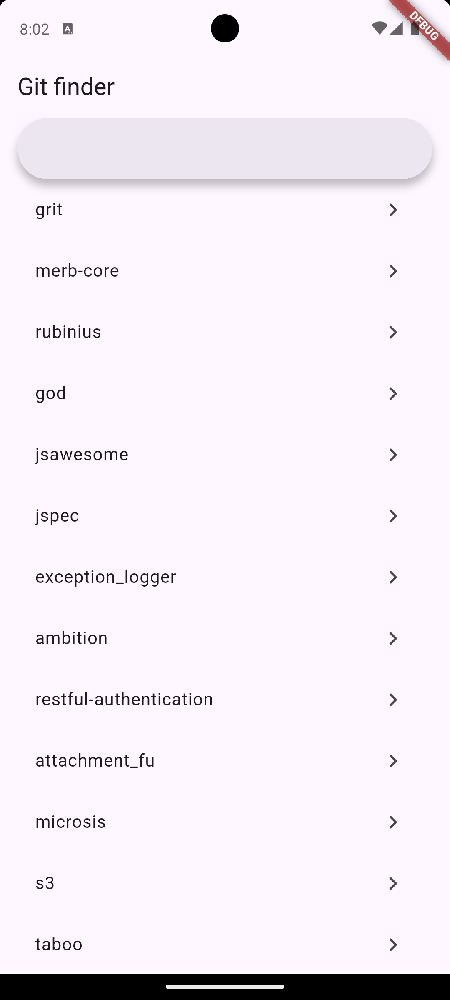
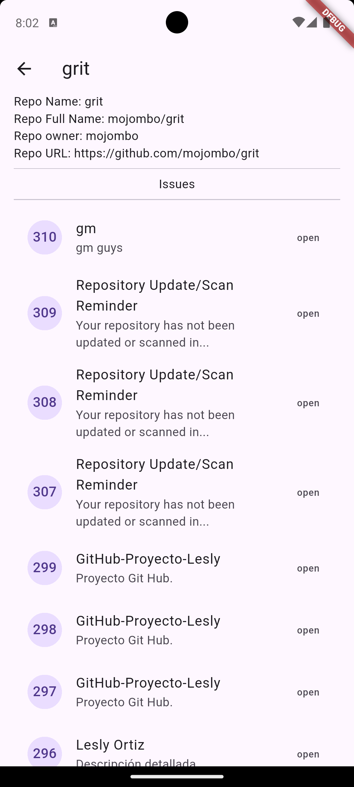

# git_finder

Git Finder is a Flutter application designed to help users explore GitHub repositories and issues seamlessly. With this app, you can search for repositories, view their details, and browse through issues with smooth user experience.

## Features

- Search for GitHub repositories by name or keyword.
- View repository details, including owner information and link.
- Refresh repository and issue lists with pull-to-refresh functionality.
- Navigate between repositories and their issues with ease.

## Screenshots

### Home Screen & Repository Details
<div>

&nbsp

</div>

## Getting Started

This project is a starting point for a Flutter application.

### Prerequisites

- Flutter SDK installed on your machine.
- A GitHub personal access token (limited requests without PAT).

### Installation

1. Clone the repository:
   ```
   git clone https://github.com/Pirer24/git_finder.git
   cd git_finder

2. Install dependencies:
    ```
    flutter pub get

3. Run the app:
    ```
    flutter run